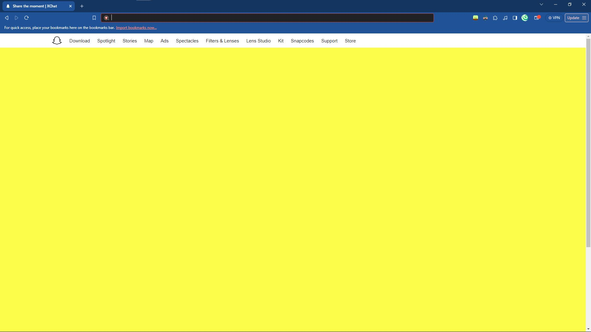

# XChat

A clone of the SnapChat Web header and footer, because there is no comprehensive guide. I am so sorry, I will have everything up by the end of this year.

This is a backup for my disk, which needs to be repartitioned, and for you, you get atleast the base of a new project.

**(Thanks DevBoss!)**

## Acknowledgements

- Tutorial by: [DevBoss](https://www.youtube.com/@devbosss)
- A Huge shoutout, to my youngest project as of writing: [XDT-XGram](https://github.com/l-xdt/xgram/)
- One of the hugest helps in this project: [Diffchecker](https://www.diffchecker.com/)

## Authors

- [LeidenSchaft Xiotim-Development Team](https://www.github.com/l-xdt/)
- [Alvin Maranx, II ツ (Avun)](https://www.github.com/avun-ai/)
- [DevBoss](https://www.youtube.com/@devbosss)

## Demo

There is a demo on this project! And I'm not being indirect, here is the link, click: [here](https://l-xdt.github.io/xchat/)

## Features

- Do however you want with it.

- Change the images and FavIcons however you want.

- Uses only HTML and CSS for extreme beginners

- Not cross-platform

- **PS:** This is extremely basic, so you have to create the rest of the base alone.

## Screenshots




**Written in Plain HTML, and CSS.. you have to create the rest on your own. Do whatever you please**

## Run Locally

Clone the project and run it on XAMPP

(**PS:** I would recommend, an alternative domain from localhost, to add to reality of the effect.)

```bash
  git clone https://github.com/l-xdt/xchat/
```

Go to the project directory

```bash
  cd xchat
```

Install XAMPP (via Chocalatey, if you don't have it.)

```bash
  chocalatey install xampp
```

Start the server

```bash
  [Directory]/[ServerName]/apache-start.bat
```

**PS:** If you trust your web skills, here is a manual on how to self-host a domain: [here](https://www.youtube.com/watch?v=_eQGAJVtRCs) (by Soeng Song)

## Roadmap

- Additional browser support

- Create what your website wants to be.

- Change the 2 images you want to see.

- Make the website in your style.

- This is all written in **Vanilla HTML and CSS**

- The Favicon is influenced by the signature: **X**

## Support

For support, reach out to us via either of our emails: [this one](mailto:trowesigames@gmail.com) or [this one](mailto:leidenschaft.tech@gmail.com) or join our Discord Group: which is not up as of writing this readMe.

## Feedback

This still applies to feedback as well, but keep in mind this is a little out-dated and
really more useless than my other projects. Whether you want to give us positive words or negative ones send away! (but please send only constructive-critisism). Send away [here](mailto:trowesigames@gmail.com) or [here](mailto:leidenschaft.tech@hotmail.com)

## FAQ

**Now, my favourite, FAQ!**

#### Can I change this or create something new on to of this in anyway I please?

Absolutely, This is meant to be a repository to be changed into whatever you please. You are given full creative permission.

#### Can I host this, If I can, how?

You can use my personal favourite, XAMPP! The one I have gone into detail from the first read-me! wI always loved it for simple projects like this one. 

It works by using the IP that works on every Windows, Linux (and some macOS) computers:
127.0.0.1 use to host your little websites.

You can start by getting started using this tutorial by: MainlyWebStuff, click [here](https://www.youtube.com/watch?v=LzucEZh4_no). And for a new domain instead of localhost, click [here](https://www.youtube.com/watch?v=_eQGAJVtRCs) for a tutorial by: Soeng Song.

## Used By

This project is used by the following companies:

- LeidenSchaft-Xiotim Accquistions (Limited)

- XDT-Studium

- Xiotim Development Team [Limited] (XDT)

- XDT-noHesi

## Related

Here are some related projects

- [XioTok](https://github.com/l-xdt/xiotok/)

- [noHesi](https://github.com/l-xdt/no-hesi/)

- [Xirox](https://github.com/l-xdt/xirox/)

- [Studium](https://github.com/l-xdt/studium/)

- [XioTim](https://github.com/l-xdt/xiotim/)

- [XioTube](https://github.com/l-xdt/xiotube/)

- [xSocial](https://github.com/l-xdt/xSocial/)

- [XGram](https://github.com/l-xdt/xgram/)

## Documentation

- I cannot tell you all about the documentation, so please check out the tutorial linked below:

- [Snapchat Page](https://www.youtube.com/watch?v=VpeSSsC4i6I) by DevBoss (on YouTube)

## API Reference

As earlier refrenced, there is no APIs used or any Frameworks, or even any Javascript, jut a very base-level project, if used, I will update this readMe.
